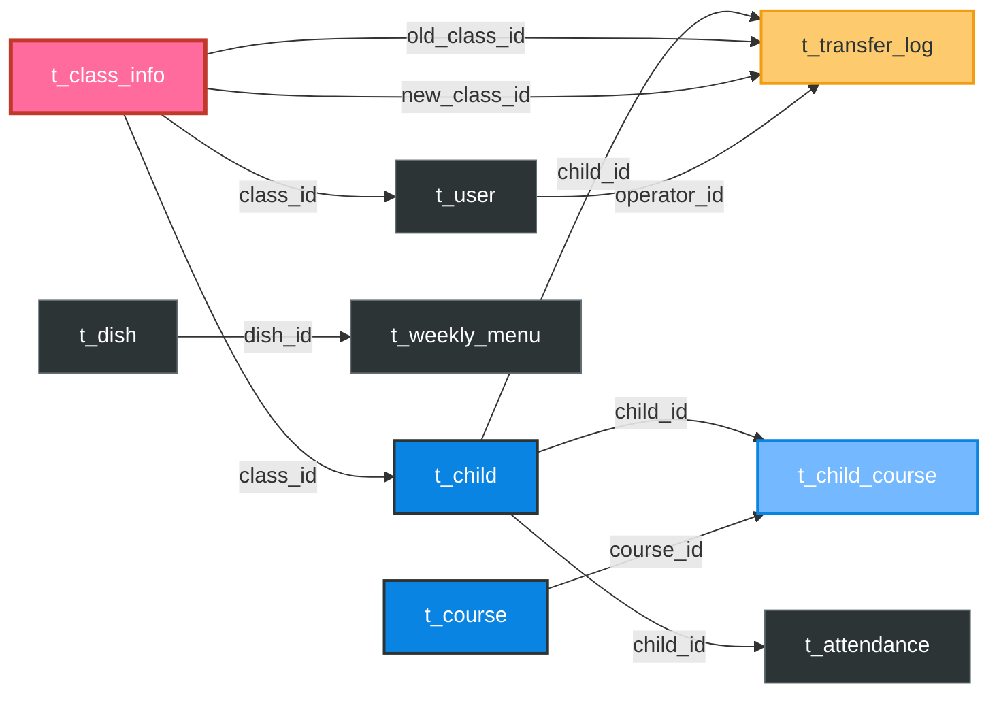

# 幼儿园管理系统 数据库ER图

---

## 颜色说明

| 颜色 | 含义 |
|------|------|
| **粉色** | 核心表（t_class_info 班级表），系统中心，被多张表引用 |
| **蓝色** | 关系表（t_child_course 选课表），多对多中间表 |
| **灰色** | 普通表 |

## 按功能分组

### 核心表（班级表）
> 班级表是整个系统的中心，幼儿表、用户表、考勤表、调班日志表都通过 `class_id` 外键关联它

- **t_class_info**

### 选课关系（多对多）
> 幼儿表和课程表通过选课关系表形成多对多关系，每个幼儿最多选 4 门课

- **t_child** —— `t_child_course` —— **t_course**

### 考勤记录
> 一个幼儿每天一条考勤记录，通过 `child_id` 关联幼儿表

- **t_child** —— `t_attendance` —— 状态：1出勤 2缺勤 3请假 4迟到

### 食谱管理
> 菜品库为基础，每周食谱通过 `dish_id` 引用菜品

- **t_dish** —— `t_weekly_menu`

### 调班日志
> 记录原班级和新班级，关联幼儿表、班级表和操作人（用户表）

- **t_child** + **t_class_info**（old/new）+ **t_user** —— `t_transfer_log`
